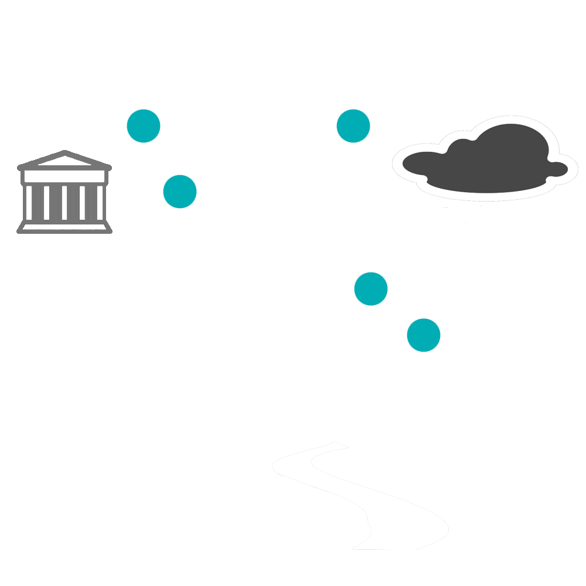

---
# You don't need to edit this file, it's empty on purpose.
# Edit theme's home layout instead if you wanna make some changes
# See: https://jekyllrb.com/docs/themes/#overriding-theme-defaults
layout: single
title: The BERT for Humanists Project
---

In the last several years, natural language processing research has been revolutionized by a new technology known as **large language models**, or LLMs.

Beginning with the model called BERT in 2018, these state-of-the-art methods can understand human language significantly better than previous methods, and they now serve as the foundation for a wide variety of everyday tasks — from grammar checking to autocomplete, from translation to speech-to-text.

The BERT for Humanists project is developing resources to inform, empower, and inspire humanities scholars to use LLMs in their disciplines in creative new ways. We seek to provide an intellectual framework for understanding and evaluating these new computational language technologies, so that humanists may be positioned to make use of — and to critique, as appropriate — the advances that will inevitably supplant BERT, in particular, and large language models, in general.

The BERT for Humanists project was generously supported by the National Endowment for the Humanities in 2021. The project is ongoing.

